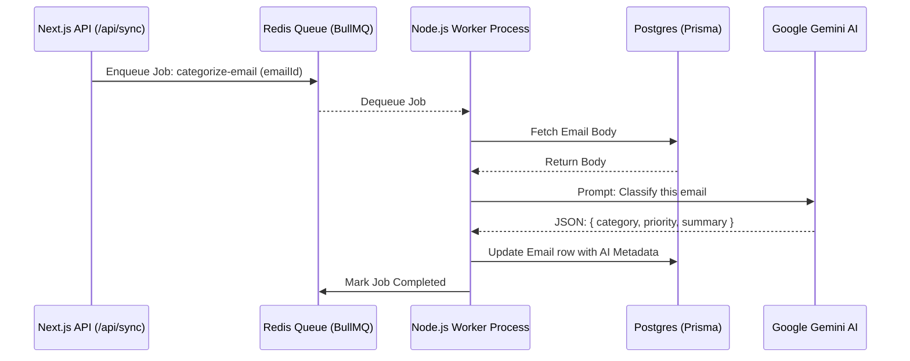
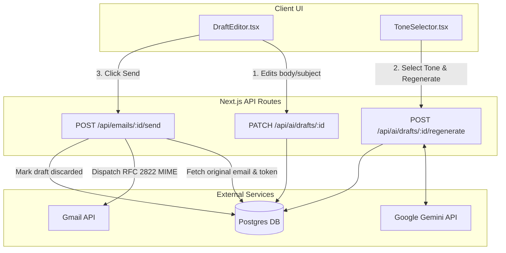

# Architecture: Phases 3 & 4

This document outlines the technical architecture for the background processing (Phase 3) and the user-facing AI Reply Assistant (Phase 4) in MailPilot.

---

## Phase 3: Background AI Worker Architecture

Phase 3 is responsible for offloading heavy AI processing (categorization, summarization, extraction) from the Next.js web server to a dedicated background Node.js process using BullMQ and Redis.

### System Diagram

### Core Components

1.  **`src/lib/queue.ts`**: The Queue definition. Configures connection to Redis (local or remote via Upstash) and defines strongly-typed job payloads (`EmailJobData`).
2.  **`worker/email-worker.ts`**: A standalone long-running Node.js process. It connects to the same Redis instance, pulls jobs off the queue, and processes them concurrently (currently set to 3 at a time).
3.  **`src/lib/ai.ts` (Phase 3 parts)**: Wraps the `GoogleGenerativeAI` client. It forces Gemini 1.5 Flash to return strict JSON for predictability when parsing in the worker.

> [!TIP]
> Running the worker separately prevents the Next.js web server from timing out on long AI generations or Vercel serverless function limits.

---

## Phase 4: AI Reply Assistant Architecture

Phase 4 bridges the gap between the AI's generated drafts and the user's outbox. It prioritizes **User Control** — the AI generates and modifies drafts, but the final dispatch is entirely manual.

### System Diagram

### Core Components

1.  **`DraftEditor.tsx`**: A client-side React component maintaining local state for `body`, `subject`, and `tone`. It manages optimistic UI updates and loading states (e.g., spinning wheels) during network requests.
2.  **Regeneration Flow (`/api/ai/drafts/[id]/regenerate`)**: Takes the user's selected tone, fetches the original email from the database, and prompts Gemini to rewrite the draft entirely based on that tone, saving the result back to the database.
3.  **Send Flow (`/api/emails/[id]/send` & `src/lib/gmail.ts`)**: 
    - Fetches the user's Google OAuth `access_token`.
    - Assembles a raw `RFC 2822 MIME` string combining the AI draft body, subject, and the original sender's email address.
    - Attaches the original `gmailThreadId` to ensure the reply stays grouped correctly in the recipient's inbox.
    - Dispatches the raw string to Google via `googleapis`.

> [!IMPORTANT]  
> **Security & Safety Design**: The system is hardcoded to *never* trigger the Send flow from the background worker. The `sendGmailEmail` function is only ever imported and called by the specific Next.js API route that requires an active User Session and explicit UI interaction.
